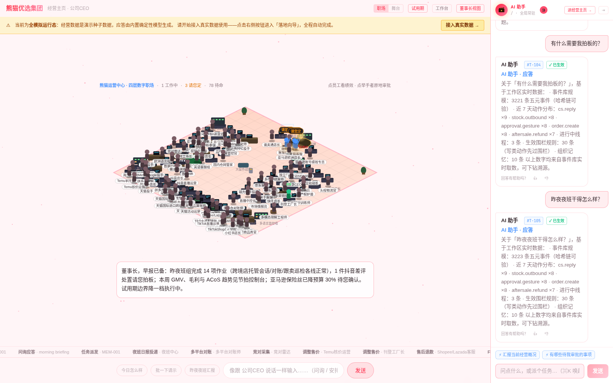
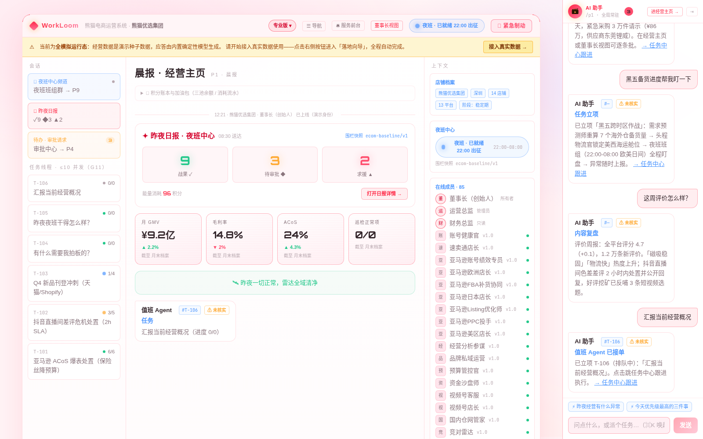
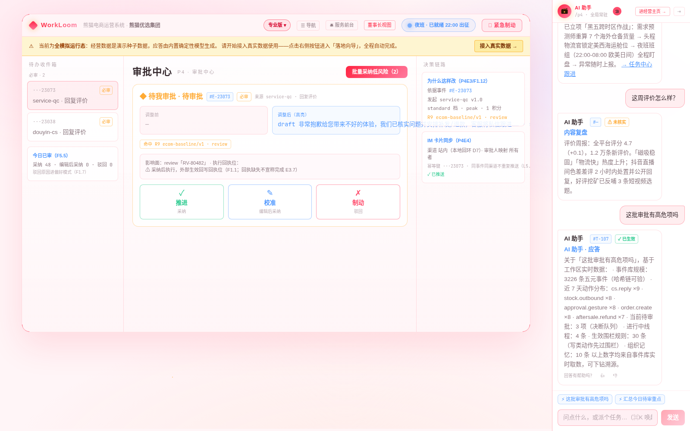
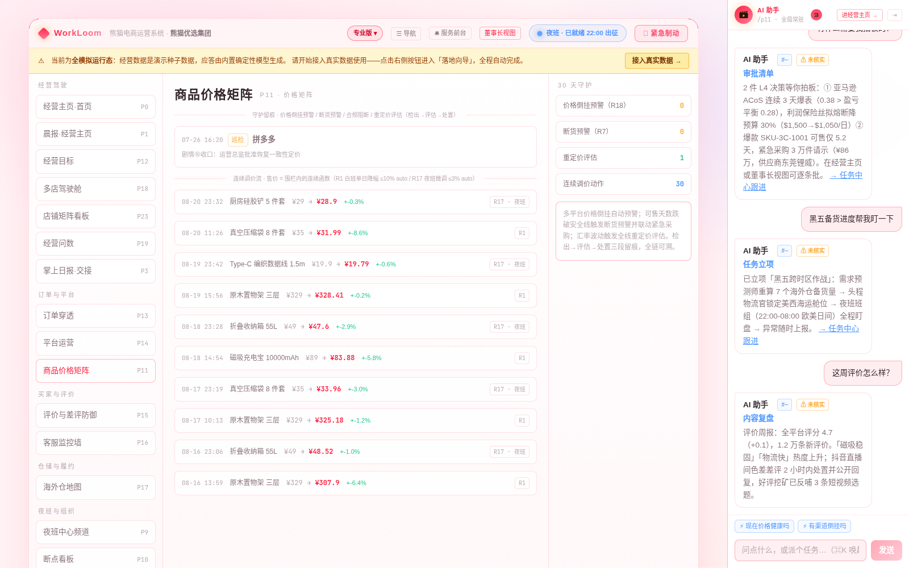
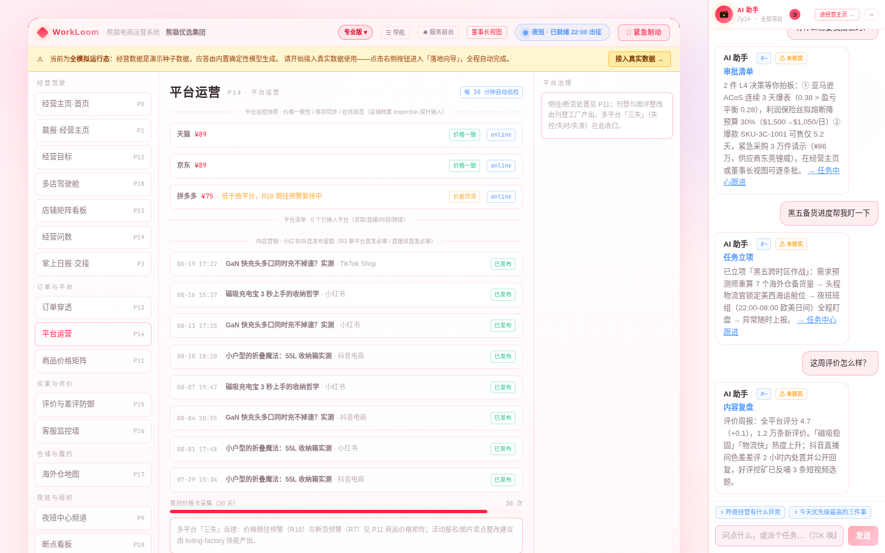
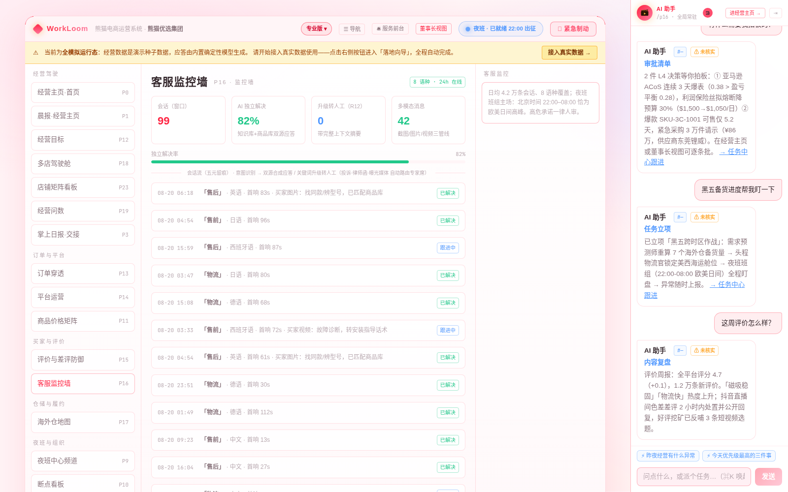
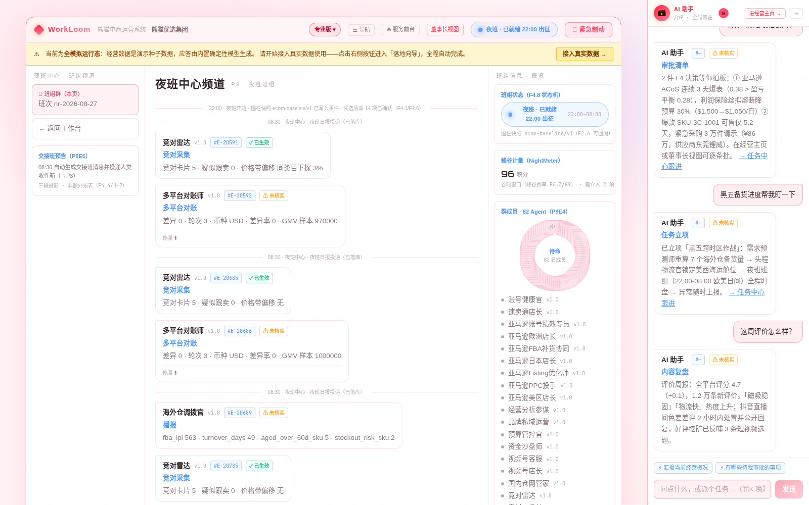
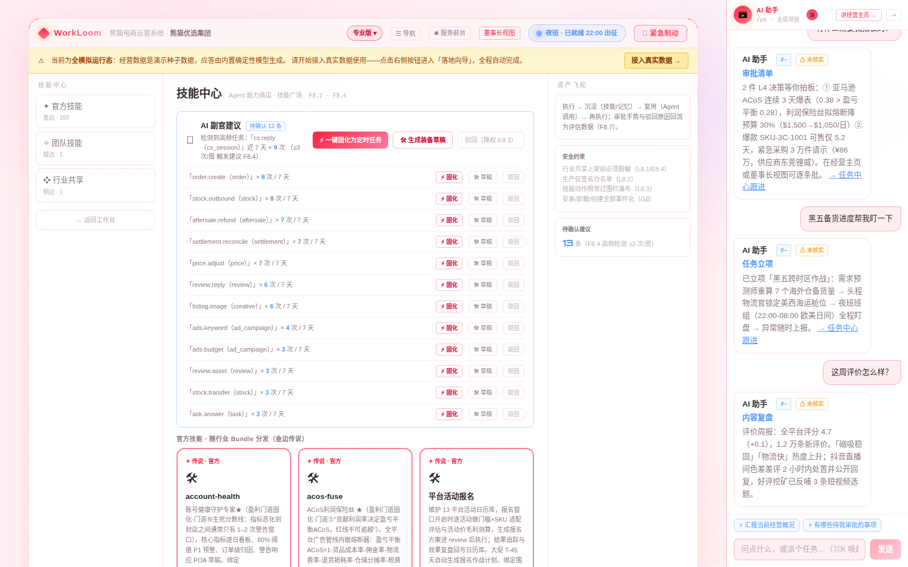
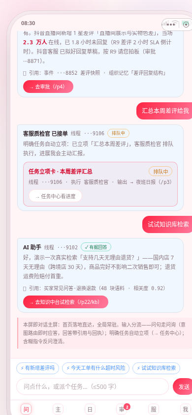
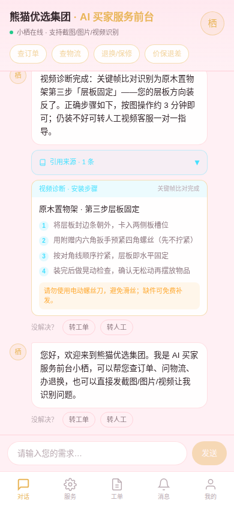

<div align="center">

# WorkLoom 熊猫电商运营系统

**让每一支电商团队，都拥有一支 24 小时不休息、比专业代运营更专业的数字员工军团。**

82 人数字军团住进你的通讯录：选品、刊登、调价、广告、客服、对账、夜班值守班——
你只做三件事：**提目标、听汇报、批少数关键决策。**

[](bundles/ecommerce/bundle.json)
[](bundles/ecommerce/fences/ecom-baseline.yml)
[](bundles/ecommerce/skills)
[](docs/DEMO-TWIN.md)
[](LICENSE)

</div>

---

## 产品定位

中国电商的绝大多数，是同时挂着四五个平台的腰部卖家、一个人盯十几个店的运营小团队、和深夜还在回英文邮件的跨境夫妻店。他们贡献了平台最多的订单，却用着最原始的经营方式——选品靠感觉、广告靠玄学、调价靠盯盘、对账靠 Excel，客服是自己熬夜顶上的。

安克那样的大卖养得起 6000 人的团队：事业部制、数字化中台、24 小时全球客服。**中小卖家不是不需要，是一直没人给他们造得起。**

WorkLoom 熊猫电商运营系统就是为这件事来的：**把过去只有超级大卖才拥有的经营能力，装进每一支电商团队里。** 这不是给卖家多一个软件，是给卖家换一种活法。

### 您的店正在漏钱，而且漏得无声无息

多平台多店铺的卖家，都在被「八大流失点」同时放血：

| # | 流失点 | 漏法 |
|---|---|---|
| 1 | **广告浪费** | ACoS 爆表的计划还在跑，烧的是净利润 |
| 2 | **断货** | 爆款断货 7 天，排名和流量权重跌回解放前 |
| 3 | **积压** | 库龄 90 天的货压着吃现金流，清仓又亏毛利 |
| 4 | **差评流失** | 差评隔夜才发现，2 小时黄金防御窗口已过 |
| 5 | **客服响应流失** | 售前询单 5 分钟没人回，买家已在别家下单 |
| 6 | **对账渗漏** | 13 平台账单和订单对不平，0.3% 的差异一年就是几十万 |
| 7 | **平台罚款** | ODR / 迟发率越线、违规词上架，罚单一来一个准 |
| 8 | **汇率损耗** | 5 币种结汇时机靠拍脑袋，一波波动吃掉一个点的净利 |

行业测算这些流失每年吞掉卖家 **3–8% 营收**——一家年营收 3000 万的店，就是 90–240 万，**相当于白养一支运营团队**。

### 换一种活法：七件消失的事

这套系统最值钱的不是自动化，是**经营方式的重构**——回到每件事的目的，用全新方式达成，让原来的工作本身消失：

| 原来的事 | 现在 |
|---|---|
| 月底**对账**对到深夜 | 每笔账单发生瞬间即与订单勾稽——**对账这个动作消失**，月底只看 0.3% 的差异项 |
| 每天**手动调价**盯盘 | 价格在毛利红线内成为连续函数，运营只做策略家——**策略即配置** |
| **广告**靠玄学加码 | ACoS 保险丝自动熔断，预算随盈亏平衡点呼吸——**烧钱有保险丝** |
| **差评**隔夜才发现 | 分钟级推送 + AI 起草，防御窗口前移到买家提交后的 2 小时 SLA 之内 |
| 跨平台搬数据**做报表** | 经营问题用自然语言直接问，秒级出数——**报表作为产物消失** |
| 客服**三班倒** | 8 语种 AI 前台 24 小时应答，人工只剩一条「例外通道」 |
| 老店经验**随人走** | 打法固化为技能与组织记忆——**第 15 家店比第 1 家更好管** |

### 三笔账，算给您听（腰部卖家 · 年营收 3000 万口径）

- **💰 降本**：客服三班倒、刊登、调价、对账、报表、回评六大机械劳动被数字军团接管——跨境客服夜班一项，年化即省出一到两个小语种客服的年薪；
- **📈 增收**：广告浪费熔断拦截、断货提前 7 天预警、差评 2 小时 SLA 内响应、对账差异逐笔派单、价格倒挂分钟级守护——漏出去的钱，一分一分捡回来；
- **🚀 规模**：集团驾驶舱一屏看全部店铺，决策包汇聚、告警收敛、店铺健康排名——管理半径翻倍，而人不用增加。

> 中性测算年化价值 **112–347 万**；最保守情景仍数倍于订阅成本。（示例测算，可按您店铺实际情况替换）

<!-- CAPABILITIES:BEGIN -->
<!-- 本区块由 scripts/generate-capabilities.mjs 自动生成（2026-08-28），请勿手改；重跑 pnpm capabilities 更新 -->

## 🧩 系统能力速览（自动生成 · 与代码同步）

- 🖥 **三端应用（开箱即看）**：PC 端 · B 端工作台 · 移动端 · B 端高保真 · 移动端 · C 端 AI 服务前台
- 🐼 **行业 Bundle（垂直能力包）**：bundles/ecommerce/
- 🖐 **操作电脑能力（本仓自带 · 可装生产工作站）**：computer-use 三层感知（65 动作） · HTTP 远程驱动 + MCP server
- 🤖 **AI 自动化引擎（系统内置能力）**：围栏 DSL 引擎 · L2 编排（ASK/QUEST） · 夜班自动运行 · 模型路由 · 五元事件 + RLS 隔离 · IM 渠道 等 9 项
- ✅ **验证与质量（工程纪律）**：一键安装（bootstrap） · 主测试套件 · 发布门禁 · 五元事件验链 · Agent 能力巡游 · 环境自检
- 🎁 **演示与交付资产**：高保真演示页 ×6 · 官网静态站 · 自带技能 ×3 · 能力导览 PPT · Mock 数据体系

> 📖 完整能力导览（含截图与体验路径）：[docs/capabilities.auto.md](docs/capabilities.auto.md) ｜ 🤖 AI Agent 入口：[AGENTS.md](AGENTS.md) ｜ 🎯 首启必跑：`pnpm preview:all`
<!-- CAPABILITIES:END -->

---

## 核心能力

### 一支 82 人的数字军团，而不是一个聊天框

**1+2+N 编制（81 业务编制 + 1 只读巡检员）**，与安克「事业部制 + 中台」的真实组织同构：

- **1 个集团指挥层（4 人）**：集团数字 CEO、经营分析参谋、预算管控官、数字 HR
- **2 大作战军**：国内作战军（26 人）——天猫 / 京东 / 拼多多 / 抖音 / 快手 / 小红书 / 视频号 / 天猫国际 8 个平台战队；跨境作战军（24 人）——亚马逊 / Temu / TikTok Shop / Shopee / 速卖通 & SHEIN / 独立站 6 个战队 + 多语言客服中心
- **5 个共享中台（27 人）**：数据 / 商品 / 供应链 / 财务 / 合规风控与内容客服——选品方法论、一盘货、财务口径、素材产能两军共享，不重复建设
- **技能市场**：161 个官方技能（含 48 个 ★ 门道固化）是可见、可装、可迭代的资产，每项技能都带验收用例，使用采纳率回流驱动迭代
- **意识系统**：高频重复工作被自动检测，每周产出「固化建议」——您一键确认，系统就把这件事变成自动触发器

### 夜班班组：把夜晚还给卖家

每晚 22:00 自动出征——北京时间 22:00–08:00，恰为欧美日间高峰：竞对采集 → 多平台对账 → 价格微调 → 清晨 08:30 交付三段式决策包（✓已完成 / ◆待审批 / ▲需介入）。任意时刻一键暂停，60 秒内全端生效，恢复后断点续跑。

> 夜班的四层实质：① 触达上免打扰（非 P0 不叫人，全部聚合到清晨决策包）；② 权限上自降级（夜间仅白名单动作 auto、调价 ≤3%、高危审批超时升级而非自动放行）；③ 战场上是主场（跨时区作战窗口，别人睡觉时您的店还在赚钱）；④ 成本上是洼地（对账 / 报表 / 批量生产在谷时算力窗口执行，费率 ≤20%）。

### 数字 CEO：集团有一位真正的总经理

数字员工解决「手」的问题，数字 CEO 解决「脑」的问题。它统领 82 人数字军团，对经营结果负责：

- 调价与广告微调秒级直批；大促价格矩阵、广告大盘调整走**六步深度分析**（情报 → 案例回忆 → 多方案 → 红队挑刺 → 影响预估 → 建议书），重大决策试用期一律请您拍板
- 店铺 CEO → 事业部 CEO → 集团 CEO 三级汇报线，与五级审批路由对齐——**一人管十几家店的管理半径**，靠的就是这个编制
- 数字 HR 每周给每个数字员工打分；连续不达标的出具汰换诊断书 + 新员工设计方案报您批准——**汰换不是删除，是基因重组**
- 出厂默认关闭；启用须完成六步深度授权；先当 3 天「影子」只模拟不执行，再 7 天试用（权力减半），到期不自动续期；五级权限，安全禁区物理熔断；每个决策都写进不可篡改的事件账

### 通用模型路由：每一次调用都按场景定档、按倍率计量

82 个数字员工、161 个技能的每一次模型调用都按场景定档、按倍率计量、按事件可审：

- **电商场景路由表**（`bundles/ecommerce/model-policy.yml`）：8 语种客服 / 跟价守护走 L1 秒级轻量档（日万级会话的成本命门）；广告分析 / 13 平台对账 / 内容生产走 L2 谷时批量；listing 工厂 / 选品深度研究 / 六步深度决策走 L3 旗舰档（noDowngrade）；合规审核串联场景（生成 → 审核双模型计费）
- **👍/👎 一键升级重答**：差评回复草稿（多语种）常驻反馈钮，点踩升档重答对比展示；Ask 应答卡同装
- **积分三池账本 + 加油包**：五档加油包 450 → 13,800 元
- **工资锚定**：全月消耗 ≈ 一个基础运营的月薪（≈5,000 元），换来 82 人数字军团 + 全经营面覆盖——用 1 个人的开支撬动 10 倍编制的运营部

### 安全不是承诺，是物理约束

- **围栏引擎 R1–R30**：一切动作 100% 经过三级判定——`auto` 放行 / `review` 挂起等您 30 秒审批 / `block` 熔断告警。售价低于货品成本 ×1.15？**系统物理上无法执行**——这不是提醒，是拒绝
- **违规动作物理阻断**：刷单、删差评、虚假宣传、侵权词上架（R11 `block`）——写死在围栏里，模型再聪明也越不过去
- **拒绝默认**：数据缺失时系统熔断而非猜测；多条规则命中取最严（deny 优先）；基线只可收紧不可放宽
- **三手势审批**：涉钱、涉客、涉对外的动作（退款 ≥¥1000、赔偿 ≥¥500、广告日预算上调 >30%），必须您看清快照、给一句话理由、做一个手势
- **安全禁区**：账号封禁风险、工商投诉、律师函级事件，AI 只告警 + 升级人工，绝不自行处置

### 每一条记录都可以被验证

全部经营动作以五元事件（谁 / 何时 / 对什么 / 做了什么 / 规则影响）写入**哈希链**——逐条 SHA 锁定，包括系统自己的操作也不可篡改。多租户行级隔离、凭据不落明文、敏感信息脱敏入档。信任不靠品牌背书，**您可以当着我们的面逐条重算**（`pnpm db:verify-chain`）。

### 经验不随人走，赚钱门道内置

好投手的出价手感、老运营的选品嗅觉、金牌客服的挽单话术，过去都装在个人脑子里，人一走，店铺经营质量断崖。在这套系统里，经验沉淀为**技能与组织记忆**——**赚钱卖家的十条门道，已被反向工程成 48 个 ★ 技能内置进系统**：选品前置算账（selection-ledger★，毛利率 <10% 一票否决）、广告利润保险丝（acos-fuse★）、库存现金线（inventory-cashline★）、多平台套利（cross-platform-arbitrage★）、差评防御窗口（review-defense-window★）……**您买到的不是一个软件，是大卖方法论的机器化。**

---

## 系统截图（模拟运行态实拍）

以下截图均来自系统**模拟运行态**（「熊猫优选集团 30 天经营态」快照 + 离线确定性模型），页面顶部琥珀色横幅「当前为全模拟运行态」为系统原生标识。

### PC 端 · B 端工作台

| 经营剧场 · 熊猫运营中心（默认首页） | 晨报 · 经营主页 |
|---|---|
|  |  |

| 审批中心 | 商品价格矩阵 |
|---|---|
|  |  |

| 平台运营（多平台价格一致性巡检） | 客服监控墙（8 语种） |
|---|---|
|  |  |

| 夜班中心 | 技能市场 |
|---|---|
|  |  |

### 移动端

| B 端 · 移动工作台 | C 端 · AI 买家服务对话 | C 端 · 服务大厅 |
|---|---|---|
|  |  |  |

---

## 使用方式

### 三种卖家，三种答案

**🛒 单平台多店腰部卖家**：广告、断货、差评、客服四大出血点一次堵上，一年省出几个客服的年薪——一个月看到回头钱。

**🇨🇳 国内多平台大卖**：淘天 / 京东 / 拼多多 / 抖快 / 小红书 / 视频号一盘棋——多平台价格守护防倒挂、一盘货视图、13 平台账单逐笔勾稽。种草、直播、大促，每个平台的打法系统都懂。

**🌏 跨境超级大卖集团**：国内 / 跨境两军作战 + 共享中台——多币种结算、9 国 VAT、海外仓调拨、8 语种客服，夜班班组主场盯欧美盘。**把夜晚还给创始人，把欧美白天交给数字员工。**

### 先体检，再托管

新客户默认从「质检模式（Audit-Only）」起步：接上 13 平台店铺数据后系统**只读扫描、不写回一个字**，五线巡检（价格健康 / 库存健康 / 广告健康 / 客服口碑 / 合规风险）异常按 P0/P1/P2 分级，1–2 周产出《店铺体检报告》（一店一份 + 集团总览 + 整改建议，估算挽回金额）。您在平台侧人工处置、系统跟踪闭环；看到漏的钱之后，再一键切换影子模式（3 天只看不做）→ 正式托管。

- ⚡ **快照快扫**（fast-scan 技能）：授权后 15–30 分钟基于历史数据快照完成五线深度扫描，当场出《快速体检报告》
- 🔍 **持续体检**（inspection-suite）：1–2 周观察期，捕捉响应时长实测 / SLA 履约 / 趋势峰值等只有时间能回答的问题
- **围栏纪律**：体检期一切写操作物理 block（`fences/patches/audit-only-patch.yml`）

### 您未来的一天

> **08:30** 夜班班组的集团决策包已经到了：「昨夜完成 23 项——欧美盘客服零排队、13 平台对账差异 ¥412 已派单、亚马逊两个 ACoS 爆表计划已熔断降预算；2 项待您批准；0 项需要您操心。」3 分钟开完「晨会」。
>
> **10:00** 双 11 备货沙盘已按销量预测生成，3 个断货风险小于 7 天的爆款 SKU 已拟好紧急采购单——您审了一遍，确认下发。
>
> **14:00** 大促流量高峰，客服零排队：8 语种买家服务前台秒级应答——买家发截图问订单异常、发图片找同款辨型号、发视频问安装故障，AI 全部看得懂、接得住。
>
> **16:30** 亚马逊某计划 ACoS 连续 3 天越过盈亏平衡点，利润保险丝已自动降预算 30% 并请您过目——过去这种事月底对账才发现，几万块已经烧完。
>
> **22:00** 夜班班组准点出征。您关了手机，去看孩子的家长会。
>
> **夜里 01:20** 一位德国买家问尺码，AI 德语 2.8 秒回复；一位美国买家威胁差评索赔，系统安抚后按升级规则转值班手机——**没有打给您**。

---

## 快速开始

### 一键跑起来（推荐）

```bash
git clone https://github.com/geniusdapeng-collab/panda-cineforge.git
cd panda-cineforge
pnpm setup && pnpm preview:all
```

`pnpm setup` 是一键安装：环境检查 → `.env` → 依赖 → PostgreSQL（docker compose 自动建容器）→ 迁移种子 → 可选「操作电脑」桌面栈，幂等可重复跑。`pnpm preview:all` 一键拉起**三端全貌**并自动固化 Mock 模拟数据（无需任何真实后端 / 密钥）：

| 端 | 地址 | 说明 |
|---|---|---|
| PC 端 · B 端工作台 | http://localhost:3000 | 经营剧场 / 任务中心 / 规则中心 / 大促作战室 |
| 移动端 · B 端 | http://localhost:3001 | 高保真演示页 + 手机壳容器（自动发现） |
| 移动端 · C 端 | http://localhost:3002 | 买家服务前台 H5（多模态 · 8 语种，演示直登） |

> **首次启动必须执行 `pnpm preview:all`**，否则视为未完成环境初始化。Mock 数据口径见 [`mock/README.md`](mock/README.md)；验收清单见 [`PREVIEW_CHECKLIST.md`](PREVIEW_CHECKLIST.md)。

### 30 秒进入「经营中的电商集团」（数字孪生快照）

```bash
cp .env.example .env
pnpm install && pnpm db:migrate
pnpm demo:twin:restore        # 恢复「熊猫优选集团」30 天经营态（随仓快照）
pnpm dev                      # 经营剧场 → 夜班 → 广告驾驶舱 → SKU 损益账本 → 店铺矩阵 → 一店一档
pnpm db:verify-chain          # 现场验证：全库哈希链逐条重算
```

快照口径：**年营收 102 亿 RMB + 53 亿美金的超级大卖全模拟运行态**——14 家店铺 × 13 个电商平台 + 1 个独立站、在架 8,600+ SKU、日均 9.6 万单（大促峰值 180 万单/日）、日均客服会话 4.2 万条（中文 68% / 英语 22% / 其他 6 语种，含截图 / 图片 / 视频多模态样例）、在投广告计划 340 个日耗 260 万、国内仓 4 + 海外仓 7 + FBA 在库货值 11.3 亿、5 币种 9 国 VAT。全部流水以五元事件落库且互相勾稽——广告带来的订单可溯源、账单与订单 / 售后可对平（故意留 0.3% 差异，等对账师去发现）。

### 从模拟运行态到真实数据

种子 / 快照完成后系统即进入**全模拟运行态**：经营剧场（等距 2.5D「熊猫运营中心」，国内战区 / 跨境战区 / 中台楼层 / 客服中心四层职场，82 名员工工位各就各位）、数字 CEO 晨报、待决策请示、实况字幕流，全部为演示数据 + 内置确定性模型（零外部依赖）。页面顶部常显琥珀色横幅提示「当前为全模拟运行态」，点击「接入真实数据 →」进入**落地向导**（`/onboarding`）：

1. 环境自检（自动）
2. 接入真实大模型（DeepSeek / Kimi / 智谱 / OpenAI 预设一键填，真实试调通过才落盘，保存即全链生效免重启）
3. 登记经营主体
4. 启用真实模式（横幅熄灭，全程五元事件留痕；此后即可接入真实平台店铺数据源）

Ask 问询另支持联网实时检索事实面（`ASK_WEB_SEARCH=1`，Bing RSS，免密钥）——比如晨会前直接问「黑五前美国站竞对价格带变动，对我们 Listing 定价的影响」。

**质量门禁**：typecheck 全绿 · base 407/407 · runtime 9/9 · suite 443/443 · 哈希链逐条一致（每版实测）。

---

## 面向 AI Coding Agent

本仓库对 AI Coding Agent 原生友好，进仓请按以下顺序：

1. **先读 [`AGENTS.md`](AGENTS.md) 与 [`.ai-prompt`](.ai-prompt)**——仓库的强制约定与入场指引；
2. **首启必跑 `pnpm preview:all`**，未完成视为环境初始化未完成；
3. **一键能力巡游 `pnpm agent:tour`**（`--full` 追加种子编排 + 全部测试套件 + 发布门禁），全量能力清单见 [`docs/capability-map.md`](docs/capability-map.md)；
4. **本仓自带「操作电脑」能力**（`packages/base/computer-use/`，65 动作三层感知：L1 浏览器 DOM 级 / L2 全 GUI 语义树 / L3 截图像素级，不依赖任何沙箱）：`pnpm computer:preflight && pnpm computer:smoke` 即验；可装到生产专用工作站，HTTP / MCP 远程驱动见 [`docs/computer-use-production.md`](docs/computer-use-production.md)；
5. **验证纪律**：改完代码必跑 `pnpm suite`；发布前必跑 `pnpm release:gate`；改事件 / 号源后跑 `pnpm db:verify-chain`；UI 改动必须用浏览器能力实际打开页面截图核对；改了能力面必须跑 `pnpm capabilities` 重新生成导览。

---

## 产品理念：四个「反直觉」的坚持

> **拒绝默认**——宁可错杀，不可错放。
> **只紧不松**——围栏只能变严，不能变松。
> **断点是资产**——每次做不到，都必须让系统下次做得更好。
> **把夜晚还给卖家**——技术的终极指标，是人能不能睡个整觉。

## 文档索引

- [完整能力导览（自动生成）](docs/capabilities.auto.md) ｜ [全量能力清单](docs/capability-map.md)
- [经营体验与演示指南](docs/DEMO-TWIN.md) ｜ [四客群默认装配清单](bundles/ecommerce/segment-defaults.yml)
- [围栏基线 R1–R30](bundles/ecommerce/fences/ecom-baseline.yml) ｜ [161 个官方技能](bundles/ecommerce/skills)
- [操作电脑能力生产部署指南](docs/computer-use-production.md) ｜ [浏览器自动化指南](docs/agent-computer-guide.md)
- [底座技术文档](README-CORE.md)

## 我们的野心

电商过去二十年的数字化，是超级大卖的数字化——他们买得起 ERP 矩阵、养得起 6000 人团队、建得起数据中台。而中小卖家得到的，只是更多需要人去喂的软件。

**这一代 AI 第一次让「运营团队」本身可以被制造出来。** 当一家三个人管五个店的腰部卖家，也能拥有 24 小时不休息的夜班班组、永不疲倦的广告保险丝、记得住每位买家的 8 语种客服——行业的竞争规则就变了：**决定一家店经营水平的，不再是规模，而是选择。**

我们要做的事，是让最好的经营能力，不再是大卖的专利。

## 许可证

Apache-2.0（vendor/dsh 与 vendor/dsh-im 为 MIT）。

<div align="center">

**WorkLoom 熊猫电商运营系统 —— 换一种活法，从现在开始。**

</div>
