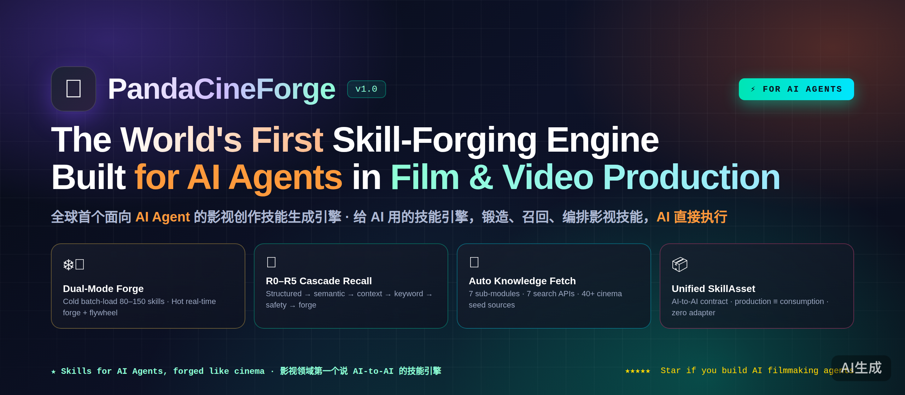

<div align="center">

# 🐼 PandaCineForge（大熊猫影视创作技能引擎）

### 全球首个面向 AI Agent 的影视创作技能生成引擎

*自包含单文件技能引擎——锻造、召回、编排影视技能，服务于 AI Agent，而非人类。*

[](./LICENSE)
[](https://www.python.org/)
[](#)
[](./CONTRIBUTING.md)
[](#-为什么给-ai-用而不是给人用)

**[English](./README.md) · [中文](#-中文文档)**

</div>

<p align="center">
  
</p>

---

## 🌍 中文文档

> **一句话定位：PandaCineForge 是给 AI 用的技能引擎。它锻造专业影视技能，通过固定化契约服务于 AI Agent——让你的 AI 视频制作 Agent 不再靠猜，而是直接执行工业级工作流。**

这是**全球首个面向 AI Agent 的影视创作技能生成引擎**，一个通用化支撑底座，为任意 AI 视频制作系统的 Agent 提供按需锻造、自我进化的专业技能。

PandaCineForge 将**技能锻造（生产侧）**与**技能召回编排（消费侧）**融合为单一引擎，并以单一对象 **`SkillAsset`** 统一——生产侧输出与消费侧召回收敛为同一对象，**零适配层**。

## 🤖 为什么：给 AI 用，而不是给人用

这是理解 PandaCineForge **最重要的一点**。**它是给 AI 的技能引擎，生成的技能是被 AI Agent 消费的。**

| 维度 | 传统工具（给人用） | PandaCineForge（给 AI 用） |
|---|---|---|
| **查询形态** | 自然语言模糊 | 结构化契约 + `route_fields` 精确路由 |
| **召回** | 7 路并联全量 | **R0–R5 分层级联**，命中即返 |
| **输出** | 人类可读 Markdown | **结构化 `SkillAsset`**，AI 直接执行 |
| **专业性** | LLM 单次生成 | 双知识源 + 三段式保障 + 实战反馈飞轮 |
| **资产对象** | 生成器输出 ≠ 编排器输入 | **统一 `SkillAsset`**，生产消费收敛 |
| **知识来源** | 模型内部知识 | 内部 + **外部实时获取**（搜索 + Scrapling） |
| **进化** | 一次成型 | **v0→v3 成熟度** + 自然选择 + 知识回流 |

> 如果你的"AI 影视"栈里，Agent 还在读为人写的 Markdown 提示词，那是慢路径。PandaCineForge 就是来补这一层底座的。

## ✨ 核心特性

### 🏗️ 双模式主链路
- **冷启动（Cold Forge）**——按"全域技能矩阵"批量生成 **80–150 个核心技能**，运行时召回**零生成延迟**。
- **热运行（Hot Runtime）**——召回未命中则**实时生成**，生成即沉淀回索引（**飞轮反哺**）。

### 🔎 分层级联回（R0–R5）
| 层 | 名称 | 机制 | 延迟 |
|---|---|---|---|
| R0 | 结构化精确路由 | 按 `module_target` + `cinematic_role` + `deliverable_type` + `project_stage` + `sub_domain` 精确过滤 | <1ms |
| R1 | 语义向量召回 | 基于 `SkillAsset` embedding 的 ANN 查询（核心层） | <10ms |
| R2 | 上下文召回 | 基于调用方上下文预测性召回（项目类型/阶段/上下游技能） | <5ms |
| R3 | 关键词/Topic 补充 | BM25 + Topic Match + Slot Match | <10ms |
| R4 | 安全兜底 | 版权/审核/崩溃/丢失等紧急场景保底 | <5ms |
| R5 | 实时生成兜底 | 触发 `SkillForgeEngine`，即用即沉淀 | 异步 |

`recall_mode=fast` 仅走 R0+R1（追求速度）；`recall_mode=full` 走 R0–R5（追求覆盖）。R5 生成期间先返回降级方案——**主链路永不阻塞**。

### 🔩 五层技能锻造
`知识源层 → 知识融合层 → 多阶段锻造层 → 组合创新层 → 成熟度进化层`

### 🛡️ 三段式专业性保障
1. **知识置信度门禁**——高置信度源（主流标准）免评审，直接达 `v2`。
2. **轻量单次评审**——中置信度技能（少数）兜底。
3. **实战反馈自然选择**——终极裁判：连续 3 次达标升 `v3`，连续 2 次不达标降级。

### 🌐 外部知识全自动获取（7 子模块）
`查询构造 → 搜索网关 → 源头路由 → Scrapling 爬虫 → 内容萃取 → 知识过滤 → 知识缓存`
- **7 种搜索源**运行时自动探测：Bing、Google CSE、SerpAPI、Brave、Tavily、DuckDuckGo、SearXNG。
- **40+ 影视可信种子源白名单**（SMPTE、ACES、ITU、Netflix、Blackmagic、Adobe、Blender、Foundry、Midjourney、Runway、OpenAI、可灵、arXiv、SIGGRAPH……）覆盖 6 大信任类别。
- **3 种 Scrapling 会话**——`fast`（Chrome HTTP/3）/ `stealth`（解 Cloudflare）/ `dynamic`（network-idle 无头）。

### 📦 统一 SkillAsset 与固定化契约
**AI-AI 结构化协议**。调用方按 schema 发请求，引擎返回结构化 `SkillAsset[]`，AI 直接执行。生产侧输出与消费侧召回**收敛为同一对象——零适配层**。

### 🎬 多制作系统 Agent 编排
`module_target` 支持多系统命名空间（`系统名.Agent名`）。召回后 TopK 技能**按 `module_target` 分组分发**至对应制作系统 Agent——真正的通用**底座**，支撑任意制作系统。

### 🎥 影视垂直化
三大子领域，50+ Topic，40+ 种子源：
- **`cinema`**——电影长片，SMPTE/Rec.2020/5.1，工业级交付。
- **`short_video`**——竖屏 9:16，3 秒钩子，完播率，平台合规。
- **`ai_manga_drama`**——角色一致性，口播对位，连载钩子。

### 🧯 优雅降级——永不因缺依赖崩溃
无 `openai`？LLM + embedding 返回空，索引/召回/BM25/Topic 仍可用。无 `scrapling`？爬虫降级为 `urllib`。无 `yaml`/`jsonschema`/`jinja2`？JSON 替代。**引擎永不因缺依赖而崩溃。**

## 🚀 快速开始

### 安装

```bash
# 核心依赖（全部可选，缺失时引擎自动降级）
pip install "scrapling[all]" openai pyyaml jsonschema jinja2
scrapling install

# 环境变量
export OPENAI_API_KEY=你的key
export OPENAI_MODEL=gpt-4.1
# 搜索 API（任选其一或多选，运行时自动探测）
export TAVILY_API_KEY=...        # 或 BING_API_KEY / BRAVE_API_KEY / SERPAPI_API_KEY / GOOGLE_CSE_API_KEY+GOOGLE_CSE_ID
```

### 使用（3 步）

```python
import panda_cineforge as pcf

# 1. 初始化——从 panda_cineforge.skill.md 提取引擎代码为 panda_cineforge.py
engine = pcf.PandaCineForge(
    system_message=open("system_message.txt").read(),
    user_template=open("user_message_template.txt").read(),
)

# 2. 冷启动——批量锻造 80-150 核心技能（初始化时一次）
result = engine.cold_start()
print(result["generated_count"], result["maturity_dist"])

# 3. 热运行——你的 AI Agent 按固定契约调用
response = engine.serve({
    "call_id": "call_001",
    "caller_agent": "VisualLanguage",
    "route_fields": {
        "module_target": ["MyStudio.VisualLanguage"],
        "cinematic_role": "visual_language",
        "deliverable_type": "color_script",
        "project_stage": "postproduction",
        "sub_domain": "cinema",
    },
    "context": {"project_id": "proj_001", "project_type": "feature_film",
                "current_task": "设计第一幕调色方案"},
    "query_text": "电影调色方案",
    "recall_mode": "full",   # 或 "fast"
    "topk": 3,
})
# response.skills  -> 结构化 SkillAsset[]，AI 直接执行
# response.workflow -> 按 module_target 分组的执行步骤，可直接分发
```

> **引擎返回的技能不是给你读的，是给你的 AI Agent 执行的。** 这就是全部要点。

📖 完整 6 步流程（冷启动、热运行、召回分层、反馈飞轮、多系统编排、质检）见 [`panda_cineforge.skill.md`](./panda_cineforge.skill.md#操作指令agent-安装后执行流程)。

## 🏗️ 架构

两张"硬核"架构图见 [`/assets`](./assets)：

| 图 | 内容 |
|---|---|
| [`assets/architecture_01_pipeline.png`](./assets/architecture_01_pipeline.png) | 端到端管线：双模式 Cold/Hot Forge → 五层锻造 → R0–R5 级联回 → 排序 → 编排 → 质检门禁 |
| [`assets/architecture_02_system.png`](./assets/architecture_02_system.png) | 系统拓扑：8 层（Layer 0 SkillAsset → Layer 7 契约）+ 外部知识 7 子模块扇出 + 多系统分发 |

<p align="center">
  
</p>
<p align="center"><em>图 1 — 端到端锻造与召回管线</em></p>

<p align="center">
  
</p>
<p align="center"><em>图 2 — 8 层系统拓扑与多系统编排</em></p>

## 🧠 工作原理：飞轮闭环

```
   冷启动（批量）              热运行（每次调用）
        │                              │
        ▼                              ▼
   ┌─────────┐    沉淀          ┌──────────────┐
   │ 五层锻造 │ ───────────────▶ │  技能索引     │
   └─────────┘                  └──────┬───────┘
                                       │ R0→R5 级联
                                       ▼
                              ┌──────────────┐  未命中  ┌──────────┐
                              │    召回       │────────▶│ 热锻造 R5 │
                              └──────┬───────┘         └────┬─────┘
                                     │ 命中                 │ 沉淀
                                     ▼                      │
                              ┌──────────────┐              │
                              │  AI 执行技能  │◀─────────────┘
                              └──────┬───────┘
                                     │ 结果 + 评分
                                     ▼
                              ┌──────────────┐
                              │ 反馈自然选择  │  v0→v3 成熟度
                              │ + 知识回流    │
                              └──────────────┘
```

## 🌍 生态

PandaCineForge 是**底座**——它不是任何一个制作系统本身。它支撑：

- **任意 AI 视频制作系统**——通过 `module_target` 命名空间接入你的 Agent（如 `MyStudio.SceneDesign`、`MyStudio.VisualLanguage`、`MyStudio.AudioDesign`、`MyStudio.ContinuityReview`、`MyStudio.PromptFusion`、`MyStudio.OpeningDesign`）。
- **OpenClaw**——Agent 平台，一键安装 `skill.md`。
- *……你的系统？* `module_target` 命名空间为多系统扩展而生，欢迎 PR。

## 🤝 贡献

欢迎保持 **AI-first** 理念的贡献。见 [`CONTRIBUTING.md`](./CONTRIBUTING.md)。

## 📄 许可证

**Apache-2.0**——见 [`LICENSE`](./LICENSE)。商用友好，含明确专利授权。

## 🌟 支持

如果 PandaCineForge 让你的 AI 影视 Agent 更聪明，**点个 Star ⭐**，帮更多 AI 开发者发现它。

---

<div align="center">

<sub>由 <a href="https://github.com/GeniusDapeng">GeniusDapeng</a> 用 🐼 打造 · 影视领域第一个说 <b>AI-to-AI</b> 的技能引擎 · <a href="./AUTHORS.md">关于作者</a></sub>

</div>
